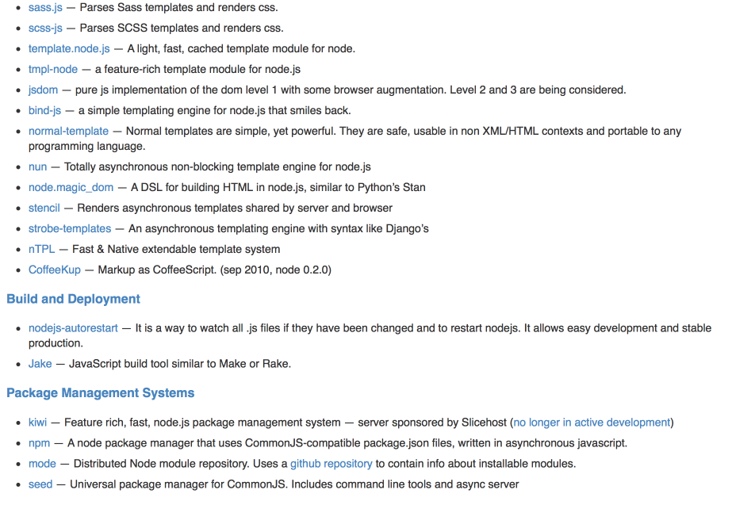
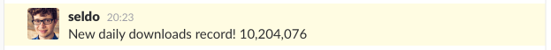
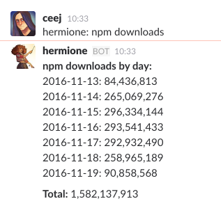
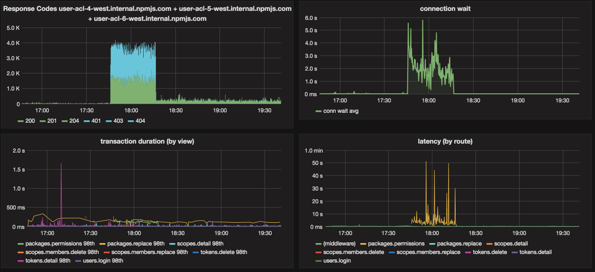
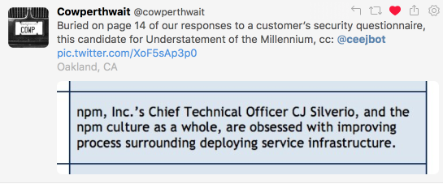
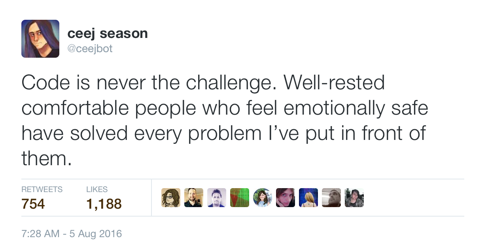

# [fit] the __accidental__ noder

---

# [fit] __or__, how I woke up & found myself running
# [fit] the npm __registry__

---

# [fit] interspersed with __diverse lessons__
# [fit] learned through a series of __epic mistakes__

---

# [fit] with the occasional __juicy hint__
# [fit] about upcoming fun things

---

# [fit] the __accidental__ noder
## [fit] C J Silverio, __@ceejbot__

^ I'm npm's current CTO. You had Laurie Voss here last year. He was our CTO then, but as you know, there can be only one. I cut off his head in single combat in a Highlander deal & now I'm CTO.

---

# [fit] what does a __CTO__ do, anyway?

^ Varies by company. I'll tell you what it means for npm.

---

# [fit] npm's __engineers__ and
# [fit] and the __systems__ they build
# [fit] are under my __care__

---

# [fit] where they are __now__ &
# [fit] where they're going __next__

---

# [fit] npm's __cli__: 3 people
# [fit] the tool you use to install

^ This is what you think of when you think of npm, but it's my smallest team.

---

# [fit] npm's __website__: 4 people
# [fit] where you look up the packages

---

# [fit] npm's __registry__: 5 people
# [fit] storing & serving 350K packages

^ This is the part of npm most people don't think about. If you ask them where the packages come from, they say "github, I guess?" But this part of the problem has been where most of my attention has been for the last three years.

---

# [fit] record-scratch noise

---

# [fit] my background looks __nothing__ like this

^ And I mean nothing. My resume says I work on consumer hardware.

---

# [fit] how the __heck__ did this happen?
# [fit] I didn't set out to do this.

---

# [fit] let's wander back in __time__

---

# [fit] I've been in the industry since 1989
# [fit] this means I'm old enough to be __your mom__

---

# [fit] think of me glaring next time you say
# [fit] __your mom__ could do something

---

# [fit] I worked at a bunch of __forgotten__ places
# [fit] General Magic, WebTV, etc

^ Most of my career was typically obscure until...

---


^ That is the T-Mobile Sidekick. Some of you might have had one of these. It was the first cool smartphone. I joined Danger, the company that made this, before it even had the idea to make them, and I shipped every single one of them.

---

# [fit] Lesson: __adapt__ or get selected out

^ the iPhone killed the Sidekick. Nothing quite like watching Steve Jobs demo features you'd shipped years ago as if they were brand-new never-before heard-of. But our CEO couldn't demo like that, so oh well!

---

# [fit] consolation prize: acquisition
# [fit] __fun__employment!

^ This is leading us around to node, really. Because funemployment is great for acquiring new hobbies.

---

# [fit] __modern__ web development

^ decided to learn how modern web pages were made in the age of jquery

---

# [fit] woo, ruby on __rails__ + backbone!

^ in 2011 this was the state of the art

---

# [fit] ruby is too __slow__

^ I need work queues! fast ones!

---

# [fit] __node 0.4__
# [fit] allegedly fast & v hipster

^ How could I resist!

---

# [fit] 0.4 was barely usable, but
# [fit] __async__ i/o was what I wanted

^ I was delighted to find a system that did non-blocking IO.

---

# [fit] javascript was a __surprise__:
# [fit] fast w/ first-class functions

^ First-class functions means you can do some real stuff with it!

---

# [fit] __npm__ existed but was different
# [fit] you found modules by reading a __wiki page__

^ the node_modules folder didn't exist

---



---

# [fit] docs were __terrible__
# [fit] I had to learn by reading source

---

# [fit] node was the most __fun__
# [fit] I'd __ever__ had writing code

---

# [fit] I found my __oldest__ node project
# [fit] and tried to run it

---

## Woah. It runs.

```
info: ---------- ljsnarf run started
info: Version: 0.1.3
info: Source account: ceej@www.livejournal.com
info: Generating session using challenge/response
debug: making flat API call with mode:  sessiongenerate
debug: requesting fresh challenge
(node:87517) DeprecationWarning: util.puts is deprecated. Use console.log instead.
(node:87517) DeprecationWarning: util.error is deprecated. Use console.error instead.
info: Recording userpic keyword info for ceej
info: Read cached data from userpics.json.
debug: making flat API call with mode:  login
```

---

# [fit] __Voxer__: a walkie-talkie app
# [fit] with a __100% node__ back end

^ bye-bye funemployment! my first experience with devops for real.  You find node everywhere now, but it was rare in 2012. I sought out voxer deliberately.

---

# [fit] __0.6__ was the first node
# [fit] that actually worked

^ Beyond the hobbyist level. You could consider putting it into production. Voxer did at some scale.

---

# [fit] attempting to __evangelize__ node
# [fit] among people writing __Scala__

^ next job; that didn't go well & neither did the company

---

# [fit] at the end of 2013
# [fit] __npm__ started falling over

^ Donated hosting & volunteer maintenance wasn't doing it.

---

# [fit] Lesson: in a viral success
# [fit] __costs__ outscale __goodwill__

---

# [fit] @izs contacted me
# [fit] do devops for __npm__?

---

# [fit] heck __yeah__

---


^ The packages must flow

---

# [fit] we got it __stable__ then we
# [fit] rewrote it in node & made it __scale__

---

# [fit] __2014__ was a good year for node

^ There will be only a handful of you here who were using node before 2014, I think.

---

# [fit] node __0.10__ was stable
# [fit] __npm__ became stable

^ There are two things that contributed to the explosion of node in 2014.

---

# April 29, 2014



^ 10,204,076

---

# October 25, 2016


^ We're now serving as many packages in an hour as we used to in an entire day.

---

# [fit] but wait! that was a __month__ ago!

---



^ I asked one of our slackbots how many downloads we've head in the last week.

---

# [fit] 296,334,144
# [fit] packages installed last __Tuesday__

^ That number is like, meaninglessly large.

---

# [fit] npm's __cli & registry__ do their thing

---

# [fit] you install from npm
# [fit] __thoughtlessly__
# [fit] & this is awesome

^ The spice is flowing!

---

# [fit] Lesson: stable __platforms__
# [fit] are where __ecosystems__ flourish

^ If all I end up contributing to node is these years of stability, it's gonna end up a high point of my career. This is a fantastic job.

---

# [fit] we did this with a __tiny__ team
# [fit] 12 engineers now; half that to start

^ The challenge all along has been here. In Aria's interviews yesterday somebody referred to a team of 20 people as small; that's almost the whole company for npm.

---

# [fit] I had __no idea__ when I started
# [fit] that I knew how to do this

---

# [fit] Lesson: I probably didn't.
# [fit] But I could __learn__.

---

# [fit] __you can too__

---

# [fit] record-scratch noise again

---

# [fit] I've learned more in the last __3 years__
# [fit] than in my entire previous career

^ This is probably hyperbole, but not by much.

---

# [fit] you ready? here comes the drop

---

# [fit] Lesson: __automate__ everything

---

# [fit] you're a __programmer__, right?
# [fit] automating things is what we do!

---

# [fit] __automate__ it so you don't have to
# [fit] __think__ about it any more

^ Free your mind to think about something else, something you don't know how to automate yet. Chatb

---

# [fit] Lesson: __observability__ is crucial

---

# [fit] if you can't observe your software
# [fit] you have __no idea__ what it's doing

---

# [fit] put a __metric__ on it

^ I don't care what "it" is. put a metric on it right now.

---



^ Graphs from a day a few weeks ago when a release of Visual Studio hit us every time somebody typed require('module')

---

# [fit] want to steal our metrics system?
# [fit] __github.com/numbat-metrics__

---

# [fit] Lesson: measure & __iterate__ ftw

---



---

# [fit] try new things __incrementally__

---

# [fit] ship a __small__ thing
# [fit] that improves your situation

---

# [fit] __measure__ & observe
# [fit] improve it incrementally

---

# [fit] __repeat__ until victory

---

# [fit] here's a concrete example:
# [fit] npm's current API is a legacy __mess__

---

# [fit] want to replace it all with
# [fit] __RESTful APIs__ for registry data

^ But this is a giant problem-- our API surface is large

---

# [fit] a search API and
# [fit] our first __React__ app in front of it

^ We're sitting right on a new search API (if you search on our website now you'll notice this)

---

# [fit] minimal change, measure & iterate
# [fit] one little __slice__ of the problem

---

# [fit] if this works, we'll do it again
# [fit] __repeat__ until victory

---

# [fit] Lesson: __simple__ is good.

---

# [fit] if you want to be __fast__
# [fit] do as __little work__ as possible

---

# [fit] make data __immutable__
# [fit] get out of a db & onto a __filesystem__

^ The registry has very quietly become about twice as fast for an average install over the last year and this is how.

---

# [fit] Lesson: __devops__ is hard
# [fit] \(but you gotta do it)

---

# [fit] the devops __skillset__ is huge

^ This is hard.

---

# [fit] the devops __mindset__ is balanced

^ This is also hard.

---

# [fit] development is __optimistic__
# [fit] operations are __conservative__

---

# [fit] __dev__: computers woohoo!
# [fit] __ops__: computers suck.

^ I am an engineer at heart. I'm an optimist. I have had to learn to be the grumpy conservative.

---

# [fit] we only run node __LTS__ releases

^ Here's a concrete example. Node's non-LTS releases are often experimental; we see a lot of temporary ecosystem breakage from them that the LTS releases don't have.

---

# [fit] we only upgrade when we want
# [fit] a new JS __language feature__

^ But we're all developers! We want those new features! But we understand the cost of having to cope with node platform thrash, so we move more slowly than we want to.

---

# [fit] Lesson: don't get __dogmatic__ about tech

---

# [fit] performance work __ongoing__
# [fit] because y'all show no signs of slowing down

---

# [fit] we're experimenting with __Rust__
# [fit] for our perf hot spots

---

# [fit] because we __love__ javascript
# [fit] but it isn't always the right choice

---

# [fit] minimal change, measure & __iterate__
# [fit] test Rust with __one__ µservice

^ Once again, the minimal change & iterate approach works here

---

# [fit] Lesson: __all__ databases are terrible

---

# [fit] you can only love a database
# [fit] you've never put into __production__

---

# [fit] corollary: your tools
# [fit] are always terri__useful__bad

^ You feel this way most strongly about things you use most often.

---

# [fit] Lesson: my job is only __sometimes__
# [fit] solving hard problems

^ CTO means chiefing the technicals, right?

---

# [fit] my job: identify the __right problem__
# [fit] & hand it to the __right person__

^ I then help that person evaluate possible solutions & remove obstacles to getting there.

---

# [fit] Lesson: __people__ are
# [fit] harder than technology

---



^ My most popular tweet ever is this one. It is hot truth.

---

# [fit] the __real__ challenge is keeping people
# [fit] in a place where they can do their best

---

# [fit] I'm __selfish__. I build the engineering
# [fit] organization __I__ want to work in.

---

# [fit] collaborative, constructive, curious

---

# [fit] I won't know how I did until
# [fit] I can __look back__ in 5 years

^ I can't put this into one of those charts.

---

# [fit] node is __still__ the most fun
# [fit] I've had writing code

---

# [fit] I __hate__ it, of course,
# [fit] because we __always__ hate our tools

---

# [fit] but node is how I write __everything__
# [fit] from twitter bots to deployment systems

---

# [fit] I want you to type __npm install__
# [fit] & have packages flow like __spice__

^ Completely thoughtlessly.

---

# [fit] npm ❤️ you

^ I'm off to ride a sandworm.
